# Umbra: Templated Lists App

Final Project for Mobile App Dev (CPTS 451) @ WSU Pullman

Written by: Kyle Swygert

## What is Umbra?

Umbra is a checklist application for iOS designed for lists that you perform repeatedly. 
If you find yourself making lists in other apps, cheking them off, then making the same list again, this is the app for you!
For example, making your favorite recipe! In Umbra, you can simply make a template list for the recipe, use that template to make a usable list, then delete the usable list when you are done. This means that you don't have to waste time unchecking boxes over and over again to make the list usable again. 

## Features of Umbra:

- Create List Templates with as many items as you want
  - List Items will be stored in the order you created them, so the usable lists will have the same order as well. 
  - Delete a List Item while making a Template in-case you messed up
- Create a Usable List from a template
  - Usable List Items can be tapped to mark that they are completed
  - If there are no templates in the app, then a Usable List cannot be created. 
- Delete all the List Templates from the app in the Settings Tab
- Delete all the Usable Lists from the app in the Settings Tab
- Still able to use a Usable List even when the template it was created from has been deleted. 
  - Example) If you make a French Toast Template, then make a Usable List from the Template, the Usable List you created can still be used in the app, even after closing the app and opening it again. 

## How to use Umbra:

### Creating a List Template
1. From the Templates tab, tap on the New Template Button to go to the Create Template page.

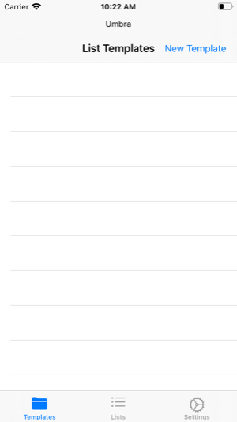
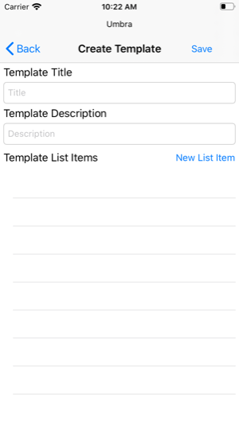

2. Fill in the Template Title and Description for the list.

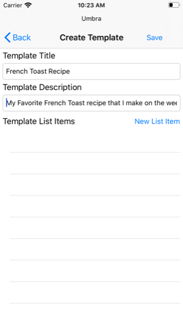

3. To insert List Items for your Template, tap the New List Item to create one List Item.
 
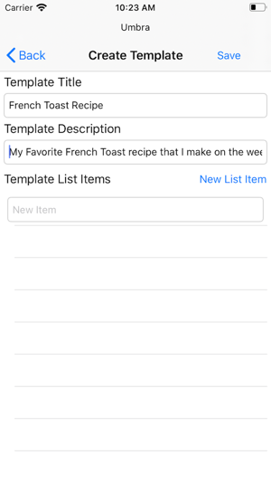

   - If you added an item by mistake, you can swipe left on the List Item to delete it.

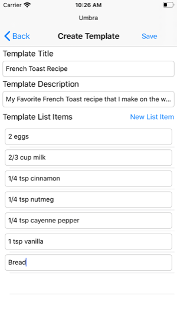
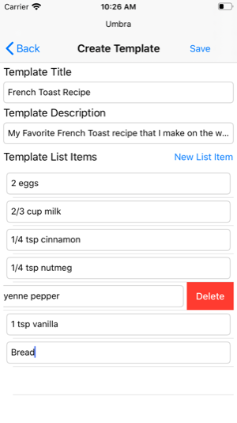
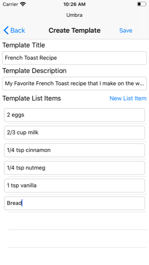

4. When you have added all the List Items you want, tap the Save button to save the Template and go back to the Template Tab
   - If you decide that you don't want to make the new template, you can tap the Back button and the Template will not be saved. 
   - When back at the Template Tab, you can tap on the Template Title to see all the contents of the list.

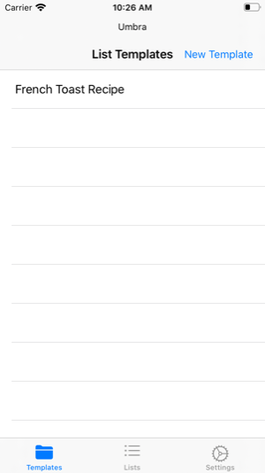
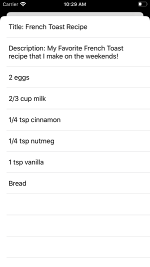

   - When you decide you want to delete a Template, simply swipe left on the Template Title to delete. 

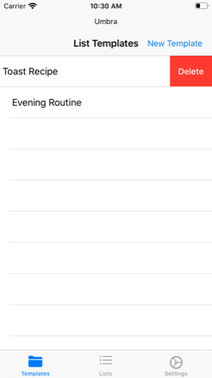

### Creating a Usable List
1. From the Lists Tab, tap on the New List Button to create a Usable List. 
2. The available List Templates will be listed in a Picker on the top half of the display, while the bottom half of the display shows the contents of the list itself. 

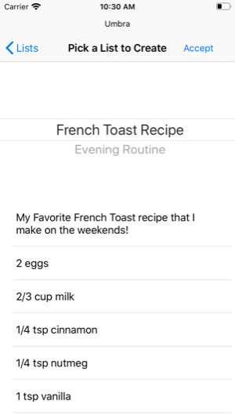

3. Scroll to the Template you would like in the picker, then tap the Accept button at the top to save your choice and go back to the List Tab.

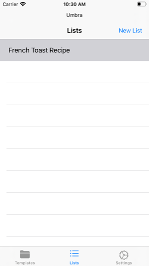

   - When back in the List Tab, tapping a List Title shows the contents of the list, and each List Item can be tapped to mark the item as complete. Tapping again will uncheck the item. 

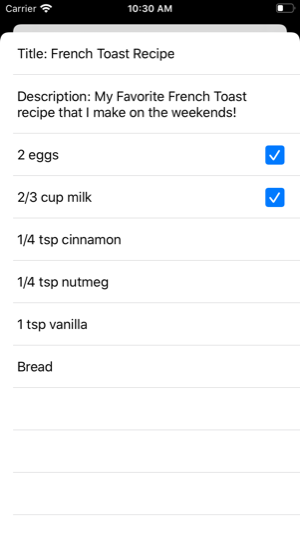

   - The checked items will be saved when the List Contents is dismissed. 
   - When you decide you want to delete a Usable List, simply swipe left on the Usable List Title tp delete. 

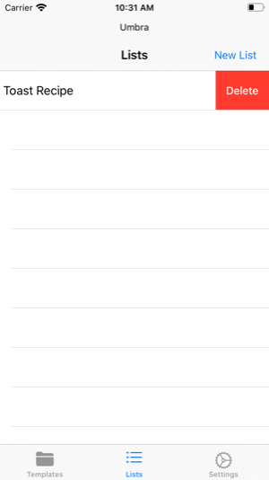

### Settings and information page
In the Settings Tab, there are three main things that can be done. 
1. Click a button to go to the GitHub link for the project. 
2. Delete all the List Templates from the app. 
3. Delete all the Usable Lists from the app. 

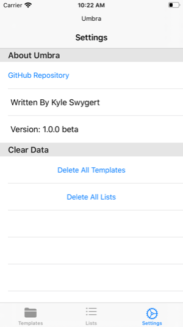